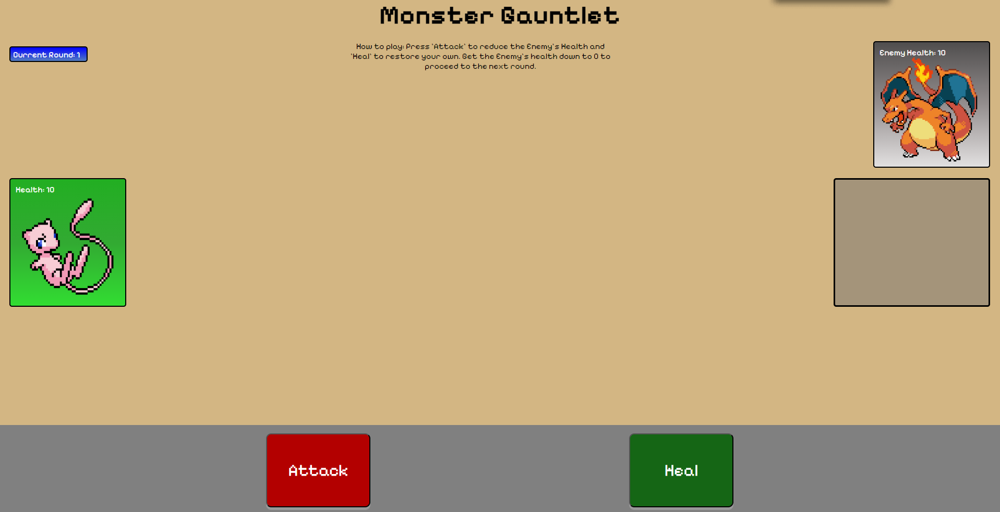

# Monster Gauntlet
**The Objective**
The objective of the game is to defeat the *Enemy* by getting it's health down to 0 while also trying to avoid having your health drop down to 0 as well.

 ## How to Play

 The ***Player*** has access to 2 buttons that will help them fight against their Enemy.
 1. The 'Attack' button will do a random amount of damage to the Enemy, once pressed, your turn is over and the enemy will strike back making it your turn again.
 2. The 'Heal' button will restore your health by a random amount, similar to the 'Attack' button, once the button is pressed your turn is over and the Enemy will strike back.

 ## How to Win

 Once your Enemy's health drops down to 0 you win! but in order to win the whole game you have to do so 3 times.  
 There are 3 rounds each harder than the last, so once you defeat all 3 then you have won the game.

 ### Why this game?

 I chose to make a game similar to pokemon because the Pokemon games have been a big part of my childhood!  
 Also turn-based games are always fun and I thought it would be fun to make a game inspired by Pokemon

 ## Link to the Game!

https://maroonmidnight.github.io/monster-gauntlet/

#### Technologies used
1. Javascript
2. HTML
3. CSS

### Planned future enhancements

If I were able to add more I would definitely make the game more complex by adding an element system or a resource to manage while fighting as to make it more strategic and complex! A better UI would be nice along with animations and the ability to choose your own moves and Pokemon!